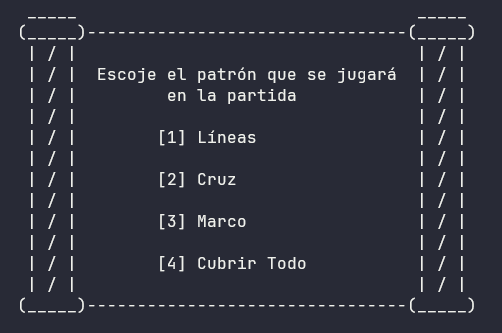
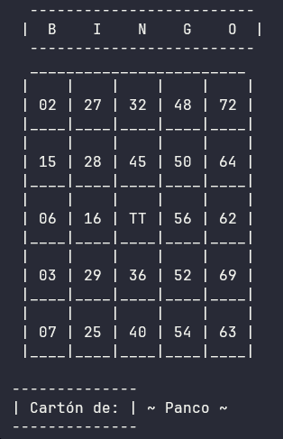
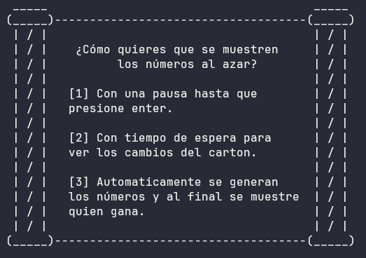
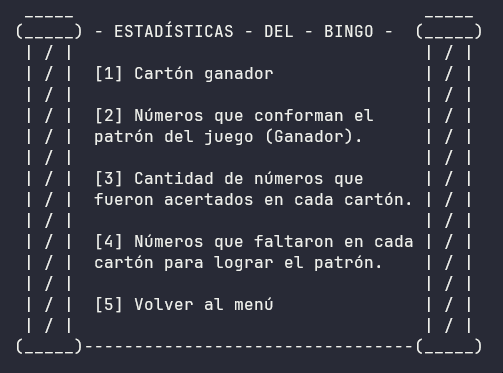

<h1 align="center" id="title">🎰 BINGO 75</h1>

<div align="center">
  

  
</div>

<p id="description" align="center">El clásico Bingo 75. Juega con 2-4 jugadores, selecciona patrones de victoria y disfruta de modos de juego dinámicos. Genera cartones únicos y analiza estadísticas detalladas al finalizar. 🏆</p>

<h2 align="center">Tabla de Contenidos</h2>

- [Vista Previa](#vista-previa)
- [Características](#características)
- [Cómo jugar](#cómo-jugar)
- [Instalación](#instalación)
- [Creado con](#creado-con)
- [Autores](#autores)

## Vista Previa ##

<div align="center">




</div>

## Características ##

- 👥 **Multijugador local**: 2 a 4 jugadores simultáneos
- 🎯 **Patrones de victoria**:
  - 📏 Líneas (Horizontal, Vertical, Diagonal)
  - ✝️ Cruces (Pequeña, Grande)
  - 🖼️ Marcos (Externo, Interno)
  - 🟦 Cartón completo
- 🎰 **Generación inteligente de cartones**:
  - Columnas B(1-15), I(16-30), N(31-45), G(46-60), O(61-75)
  - Máximo 2 números repetidos por columna entre cartones
  - Espacio libre central en columna N
- 📊 **Estadísticas detalladas**:
  - Cartón ganador y números del patrón
  - Aciertos por jugador
  - Números faltantes para completar el patrón

## Cómo jugar ##

1. **Configuración inicial**:
   - Ingresa nombres de 2-4 jugadores
   - Selecciona patrón de victoria (Línea, Cruz, Marco o Cartón completo)

2. **Generación de cartones**:
   - Cada jugador recibe un cartón único con:
     - 5 números por columna (excepto N con 4 + espacio libre)
     - Nombre del jugador en la parte inferior
   - ✔️ Acepta o regenera tu cartón

3. **Dinámica del juego**:
   - 🔢 El sistema "canta" números aleatorios únicos (1-75)
   - 🖍️ Marca automáticamente coincidencias en los cartones
   - ⏸️ Pausa estratégica entre números

4. **Victoria**:
   - 🏆 Primer jugador en completar el patrón
   - ⚖️ Desempate por mayor cantidad de aciertos
   - 🤝 Empate total si persiste la igualdad

## Instalación ##

### Método 1: Ejecutable (Windows) ###

1. Descarga el archivo `Bingo.exe` desde [Releases](https://github.com/PancoBits/Bingo/releases).  
2. Haz doble clic para ejecutarlo (no requiere instalación).  

### Método 2: Compilar desde código ###

1. Clona el repositorio:  

   ```bash
   git clone https://github.com/PancoBits/Bingo.git
2. Abre el archivo main.cpp en DevC++ 5.11.
3. Compila con F11 y ejecuta F10.

## Creado con ##

| Tecnología           | Versión   | Uso                |
|----------------------|-----------|--------------------|
|  | C++11     | Lógica del juego   |
|  | 5.11      | IDE de desarrollo  |

## Autores ##

**Franco Rodríguez**  
👔 [LinkedIn](https://www.linkedin.com/in/jeannrodriguez)

**Jesús Ruiz**
